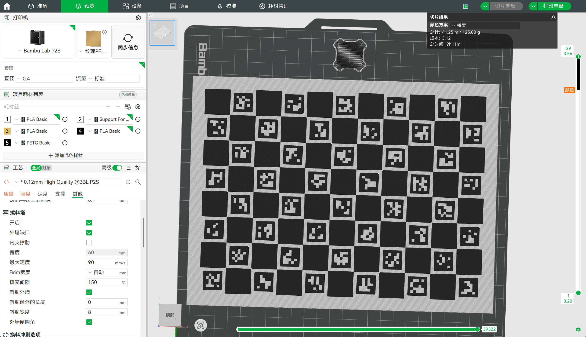

# 标定板生成器

这是一个独立的标定板生成工具，可以生成：

```text
PNG   打印/预览图
SVG   矢量预览与黑白分层
DXF   SolidWorks 草图用黑色/白色矢量层
STEP  可直接导入 SolidWorks 的三维模型
DESCR HALCON 标定板描述文件
PS    HALCON PostScript 标定板图像
```

## 四个入口脚本

每种标定板都有独立脚本，参数不会混在一起：

```text
generate_charuco_board.py       ChArUco 标定板
generate_chess_board.py         普通棋盘格标定板
generate_circle_grid_board.py   对称圆点阵列标定板
generate_halcon_board.py        HALCON 标定板
```

共享几何、DXF、STEP 导出逻辑放在：

```text
board_generator_core.py
```

普通使用时不需要修改 `board_generator_core.py`，只改对应生成脚本顶部的“用户常改参数区”。

## 快速配置环境

推荐使用 conda：

```powershell
cd charuco_board_generator
conda env create -f environment.yml
conda activate charuco-board-generator
python generate_charuco_board.py
```

Windows 也可以直接运行：

```powershell
cd charuco_board_generator
.\setup_env.ps1
.\run_default.ps1 charuco
.\run_default.ps1 chess
.\run_default.ps1 circle
.\run_default.ps1 halcon
```

如果不用 conda，也可以使用 venv/pip：

```powershell
cd charuco_board_generator
python -m venv .venv
.\.venv\Scripts\activate
python -m pip install -r requirements.txt
python generate_charuco_board.py
```

注意：生成 STEP 需要 `cadquery` 和 `shapely`。如果只生成 PNG/SVG/DXF，也仍建议使用同一套依赖，避免环境差异。

## 双色 3D 打印效果

生成的 STEP 模型包含白色基板和黑色凸起图案，适合直接导入拓竹切片软件/Bambu Studio。切片后在黑色图案开始的层高位置设置分层换色，底层使用白色耗材，图案层使用黑色耗材，就可以打印出黑白双色标定板。

下面是 ChArUco 标定板在拓竹切片软件中的预览效果：



## 生成 ChArUco 标定板

```powershell
python generate_charuco_board.py
```

常用参数在 `generate_charuco_board.py` 顶部：

```python
SQUARES_X = 11
SQUARES_Y = 8
SQUARE_MM = 20.0
MARKER_MM = 15.0
DICTIONARY = "DICT_5X5"
BASE_WIDTH_MM = 240.0
BASE_HEIGHT_MM = 180.0
BASE_THICKNESS_MM = 5.0
BLACK_HEIGHT_MM = 0.5
BLACK_SHRINK_MM = 0.02
```

命令行临时覆盖示例：

```powershell
python generate_charuco_board.py --squares-x 11 --squares-y 8 --square-mm 20 --marker-mm 15
```

## 生成普通棋盘格

```powershell
python generate_chess_board.py
```

常用参数在 `generate_chess_board.py` 顶部：

```python
SQUARES_X = 11
SQUARES_Y = 8
SQUARE_MM = 20.0
BASE_WIDTH_MM = 240.0
BASE_HEIGHT_MM = 180.0
BASE_THICKNESS_MM = 5.0
BLACK_HEIGHT_MM = 0.5
BLACK_SHRINK_MM = 0.02
```

命令行临时覆盖示例：

```powershell
python generate_chess_board.py --squares-x 10 --squares-y 7 --square-mm 20
```

## 生成对称圆点板

```powershell
python generate_circle_grid_board.py
```

常用参数在 `generate_circle_grid_board.py` 顶部：

```python
CIRCLES_X = 11
CIRCLES_Y = 8
CIRCLE_SPACING_MM = 20.0
CIRCLE_DIAMETER_MM = 8.0
BASE_WIDTH_MM = 240.0
BASE_HEIGHT_MM = 180.0
BASE_THICKNESS_MM = 5.0
BLACK_HEIGHT_MM = 0.5
BLACK_SHRINK_MM = 0.02
```

命令行临时覆盖示例：

```powershell
python generate_circle_grid_board.py --circles-x 11 --circles-y 8 --circle-spacing-mm 20 --circle-diameter-mm 8
```

## 生成 HALCON 标定板

这种标定板对应 HALCON 的 `gen_caltab()` 标准矩形圆点标定板：中间为矩形排列的黑色圆点，外围有黑色外框，左上角有三角方向标识。脚本会按 `gen_caltab(XNum, YNum, MarkDist, DiameterRatio, CalPlateDescr, CalPlatePSFile)` 的参数体系生成 PNG/SVG/DXF/STEP，并额外输出 HALCON 使用的 `.descr` 和 `.ps` 文件。

参数依据可参考 MVTec HALCON 官方 `gen_caltab` 文档：

```text
https://www.mvtec.com/doc/halcon/13/en/gen_caltab.html
```

```powershell
python generate_halcon_board.py
```

常用参数在 `generate_halcon_board.py` 顶部：

```python
X_NUM = 11
Y_NUM = 11
MARK_DIST_M = 0.02
DIAMETER_RATIO = 0.5
CAL_PLATE_DESCR = "halcon_board_11x11_20mm.descr"
CAL_PLATE_PS_FILE = "halcon_board_11x11_20mm.ps"
BASE_THICKNESS_MM = 5.0
BLACK_HEIGHT_MM = 0.5
BLACK_SHRINK_MM = 0.02
```

命令行临时覆盖示例：

```powershell
python generate_halcon_board.py --x-num 11 --y-num 11 --mark-dist-m 0.02 --diameter-ratio 0.5
```

## 输出控制

四个脚本都支持下面这些通用参数：

```powershell
python generate_charuco_board.py --no-step
python generate_chess_board.py --no-png --no-svg --no-dxf
python generate_circle_grid_board.py --output-dir outputs_custom --output-prefix my_circle_board
python generate_halcon_board.py --base-thickness-mm 3
```

输出目录默认是：

```text
outputs/
```

## 尺寸关系

ChArUco / 棋盘格标定区域：

```text
SQUARES_X * SQUARE_MM  by  SQUARES_Y * SQUARE_MM
```

圆点板标定区域：

```text
(CIRCLES_X - 1) * CIRCLE_SPACING_MM + CIRCLE_DIAMETER_MM
by
(CIRCLES_Y - 1) * CIRCLE_SPACING_MM + CIRCLE_DIAMETER_MM
```

HALCON 标定板尺寸由 `gen_caltab()` 参数派生：

```text
圆点直径 = MARK_DIST_M * DIAMETER_RATIO
黑色外框外边界宽度 = (X_NUM + 1) * MARK_DIST_M
黑色外框外边界高度 = (Y_NUM + 1) * MARK_DIST_M
黑色外框线宽 = MARK_DIST_M / 4
白色外侧留边 = MARK_DIST_M / 10
基板外形宽度 = (X_NUM + 1) * MARK_DIST_M + 2 * MARK_DIST_M / 10
基板外形高度 = (Y_NUM + 1) * MARK_DIST_M + 2 * MARK_DIST_M / 10
```

基板尺寸必须大于或等于内部标定区域尺寸。

## STEP 建模模式

四个脚本都使用 `STEP_GEOMETRY_MODE` 控制 STEP 黑色图案建模方式。

ChArUco / 棋盘格可选：

```text
rectangles_no_gaps  推荐。相邻黑色模块共享边不内缩，只在黑白交界处内缩。
rectangles          旧矩形分解。每个矩形四周都内缩，可能出现可见缝隙。
contours_filtered   整体轮廓内缩，并过滤小岛/薄壁碎片。
contours            旧轮廓模式，保留用于对比。
```

圆点板推荐：

```text
rectangles_no_gaps  生成真实圆柱凸起。
contours_filtered   按图像轮廓生成实体，主要用于对比。
```

HALCON 标定板推荐：

```text
rectangles_no_gaps  圆点为圆柱，外框为矩形凸起，左上角三角标识为三角形凸起。
contours_filtered   按图像轮廓生成实体，主要用于对比。
```

命令行临时覆盖示例：

```powershell
python generate_charuco_board.py --step-geometry-mode contours_filtered
```

## DXF 说明

DXF 默认输出黑色轮廓，并按 `BLACK_SHRINK_MM` 内缩：

```text
*_shrink0p02_black.dxf
```

DXF 文件使用毫米单位，`$INSUNITS=4`。SolidWorks 中建议将白色区域作为基板，只导入黑色 DXF 作为草图或凸起/凹槽边界。

圆点板的黑色 DXF 使用真正的 `CIRCLE` 实体；HALCON 标定板还会额外输出外框轮廓和左上角三角方向标识轮廓；ChArUco 和棋盘格使用闭合 `LWPOLYLINE` 轮廓。

## 开源发布建议

这个目录已经尽量保持独立，可以单独复制出去作为开源仓库：

```text
charuco_board_generator/
  board_generator_core.py
  generate_charuco_board.py
  generate_chess_board.py
  generate_circle_grid_board.py
  generate_halcon_board.py
  assets/
  README.md
  requirements.txt
  environment.yml
  setup_env.ps1
  run_default.ps1
  .gitignore
```

发布到 GitHub/Gitee 前，建议再添加一个开源许可证文件，例如：

```text
LICENSE
```

常见选择包括 MIT、Apache-2.0、BSD-3-Clause。没有 LICENSE 时，别人默认没有明确的复制、修改和再分发授权。
